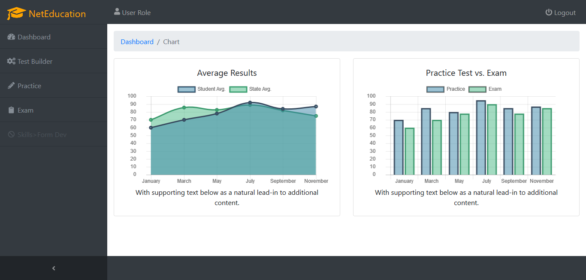

# CMS with data visualization

> Dependencies after [VueJS Webpack](http://vuejs-templates.github.io/webpack/) template
- bootstrap (jQuery, popper.js)
- node-sass
- sass-loader
- fontawesome
- ~~d2bJS~~
- chart.js
- startbootstrap-sb-admin (using Font Awesome 4.7.0)
- vuex

### Sample:

